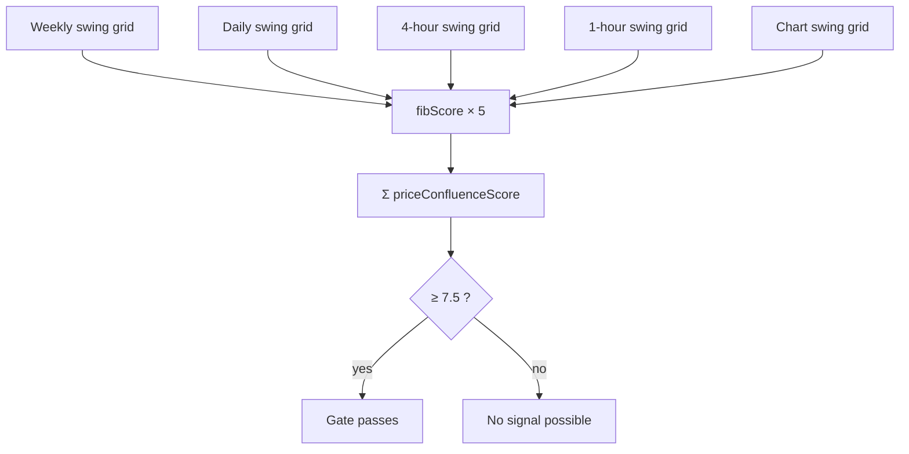

<div align="center">

# Force of Nature — IndicatorFON

**A multi-confluence Fibonacci signal engine for thinkorswim**


</div>

Force of Nature is a chart study written in **thinkScript** for the thinkorswim platform. It is built around one idea: **a signal is only worth taking when many independent techniques agree at the same price, at the same time.** Instead of firing on any single indicator, it runs eight analysis stages in parallel and plots an arrow only when *every* gate passes — by design, signals are rare.

- **thinkorswim source:** [`ForceOfNature.tos`](ForceOfNature.tos)
- **TradingView source (Pine v6):** [`ForceOfNature.pine`](ForceOfNature.pine)
- **Port analysis:** [`docs/pine-conversion.md`](docs/pine-conversion.md)

---

## Signal pipeline

Every bar, the study evaluates eight independent gates. All of them must pass — on the same bar — for a signal to print.

```mermaid
flowchart LR
    subgraph DATA["Market data"]
        direction TB
        OHLC["Chart OHLC + Volume"]
        MTF["1H · 4H · Daily · Weekly series"]
    end

    subgraph GATES["Confluence gates — ALL must pass"]
        direction TB
        G1["1 · Swing structure<br/>ATR-filtered pivots"]
        G2["2 · Fib price confluence<br/>weighted score ≥ 7.5"]
        G3["3 · Fib time window<br/>bar within ±2 of projection"]
        G4["4 · Anchored VWAP<br/>price within 0.12 × ATR"]
        G5["5 · Fib fan<br/>price near 38.2 / 50 / 61.8 ray"]
        G6["6 · Reversal price action<br/>strong close, ≥ 60% of range"]
        G7["7 · Volume surge<br/>&gt; 1.3 × 20-bar average"]
        G8["8 · RSI + HTF trend<br/>extreme/divergence + daily EMA"]
    end

    OHLC --> GATES
    MTF --> GATES
    GATES --> AND(("AND"))
    AND -->|bullish side| BULL["▲ Bull signal — cyan arrow"]
    AND -->|bearish side| BEAR["▼ Bear signal — magenta arrow"]
```



---

## Stage-by-stage breakdown

### Stage 1 — Significant swing detection

*Section `Improved Significant Swing Detection` in [`ForceOfNature.tos`](ForceOfNature.tos)*

Two helper scripts (`getSwingHigh` / `getSwingLow`) find fractal pivots: a bar whose high (or low) is the extreme of an 11-bar window (5 left, 5 right). A pivot only counts if the swing spans at least **1.5 × ATR** (`minSwingATR`), which filters out noise. The study then tracks, recursively:

| Variable | Meaning |
|---|---|
| `lastSwingHigh` / `lastSwingLow` | Price of the most recent confirmed swing high / low |
| `lastSwingBar` / `prevSwingBar` | Bar numbers of the newest and older of the two swings |
| `isUpSwing` | `true` when the swing high is more recent than the swing low |

These anchors feed almost every later stage — the Fib grid, the time windows, the anchored VWAP, and the fan.

> Note: because a pivot needs 5 right-side bars to confirm, every swing is recognized **5 bars after the fact**. This is inherent to fractal pivots, not a flaw.

### Stage 2 — Multi-timeframe Fibonacci price confluence

*Sections `Key Higher Timeframe Swings` and `Weighted Fib Score`*

Swing highs/lows are extracted from **four higher timeframes** (1H, 4H, Daily, Weekly via `HighestAll`/`LowestAll`) plus the chart's own swing pair — five Fibonacci grids in total. Each grid is scored by the `fibScore` function: price sitting within tolerance (`ATR × 0.10`) of a level earns weighted points.

```text
              ── 1.618 extension ─────────────   +1.5
              ── 1.272 extension ─────────────   +1.5
  swing high ═══════════════════════════════ 1.000
              ── 0.650 ─┐
                        ├─ GOLDEN POCKET ───    +3.5   ← heaviest weight
              ── 0.618 ─┘
              ── 0.500 ────────────────────      +2.5
              ── 0.382 ────────────────────      +2.0
  swing low  ═══════════════════════════════ 0.000
```

The five grid scores are summed into `priceConfluenceScore`. The gate passes when the total reaches **`confluenceThreshold` (default 7.5)** — which forces price to be sitting on meaningful Fib levels across *multiple* timeframes simultaneously, with strong bias toward the 0.618–0.650 Golden Pocket.



### Stage 3 — Fibonacci time / cycle windows

*Section `Fib Time + Cycle Windows`*

Fibonacci is applied to the **time axis**. The duration of the last completed swing (`span`, in bars) is projected forward from the most recent swing point at ratios **0.382 · 0.500 · 0.618 · 1.000 · 1.618**. The current bar must land within **±`timeToleranceBars` (2)** of one of those projected bars. The premise: reversals cluster at Fib-proportional time intervals of the prior swing.

### Stage 4 — Anchored VWAP magnet

*Section `Anchored VWAP`*

A volume-weighted average price is anchored at the last swing point (`Sum(close × volume) / Sum(volume)` since the anchor). Institutions commonly anchor VWAP at significant pivots, making it a magnet/defense level. The gate requires price within **0.12 × ATR** of the AVWAP — a deliberately tight band. The AVWAP is also drawn on the chart as a dashed yellow line.

### Stage 5 — Fibonacci fan proximity

*Section `Fibonacci Fan Proximity`*

Diagonal rays are projected from the last swing at **38.2% / 50% / 61.8%** of the swing's slope — rising fans from a swing low in up-swings, falling fans from a swing high in down-swings. Price must be within tolerance (`ATR × 0.10`) of one ray. This adds a *trend-geometry* dimension: price is not just at a horizontal Fib level, but also on a Fib-proportional trendline.

### Stage 6 — Quality price action (trigger bar)

*Section `Quality Price Action + Volume`*

This is the entry trigger — the bar itself must show rejection:

| Side | Requirements |
|---|---|
| **Bull** | New low below prior bar's low **and** close above open **and** close above prior close **and** close in the **top 60%** of the bar's range |
| **Bear** | New high above prior bar's high **and** close below open **and** close below prior close **and** close in the **bottom 60%** of the bar's range |

In candlestick terms: a hammer-style sweep-and-reclaim for longs, a shooting-star-style sweep-and-reject for shorts.

### Stage 7 — Volume confirmation

*Section `Quality Price Action + Volume`*

Bar volume must exceed **1.3 × the 20-bar average** (`volumeMult`), confirming real participation behind the reversal bar. Can be disabled with `requireVolume = no`.

### Stage 8 — RSI condition + higher-timeframe trend

*Sections `RSI Extreme + Simple Regular Divergence` and `HTF Trend Filter`*

Two momentum/trend gates, both individually toggleable:

- **RSI (14):** must be at an extreme — **≤ 40** for longs, **≥ 60** for shorts — *or* show the script's divergence pattern (see [caveats](#known-caveats--design-notes)).
- **HTF trend:** the daily close (aggregation configurable via `htfAgg`) must be above its **21 EMA** for longs, below for shorts. This keeps counter-trend signals off the chart.

---

## Chart output

| Element | Appearance | Meaning |
|---|---|---|
| `BullSignal` | Cyan up-arrow below the bar (weight 4) | All eight gates passed on the bullish side |
| `BearSignal` | Magenta down-arrow above the bar (weight 4) | All eight gates passed on the bearish side |
| `AVWAPLine` | Yellow short-dash line | VWAP anchored at the last swing point |
| Dashboard label | Top-left corner label | Live status of each gate (below) |

### Dashboard legend

```text
Score: 8.5 | Time: ✓ | AVWAP: ✓ | Fan: ✓ | RSI: · | HTF: ▲
```

| Field | Values | Meaning |
|---|---|---|
| `Score` | number | Current summed Fib confluence score (gate needs ≥ 7.5) |
| `Time` | ✓ / × | Inside a Fib time window |
| `AVWAP` | ✓ / × | Price within the AVWAP band |
| `Fan` | ✓ / × | Price near a fan ray |
| `RSI` | ✓ / · / × | ✓ full signal · RSI condition met alone × not met |
| `HTF` | ▲ / ▼ / ─ | Daily trend up / down / flat |

The label turns **green** when a full signal is active, otherwise stays gray.

---

## Inputs reference

| Input | Default | Description |
|---|---|---|
| `showSignals` | `yes` | Master toggle for the arrows |
| `confluenceThreshold` | `7.5` | Minimum summed Fib score (Stage 2 gate) |
| `tolerancePct` | `0.10` | Level-proximity tolerance as a **multiple of ATR** (despite the name, not a percent of price) |
| `timeToleranceBars` | `2` | ± bars around each Fib time projection |
| `minSwingATR` | `1.5` | Minimum swing size in ATRs for a valid chart pivot |
| `requireVolume` | `yes` | Enforce the volume gate |
| `volumeMult` | `1.3` | Volume must exceed this × 20-bar average |
| `requireHTFTrend` | `yes` | Enforce the higher-timeframe trend gate |
| `htfAgg` | `DAY` | Aggregation for the trend filter EMA |
| `requireRSI` | `yes` | Enforce the RSI gate |
| `rsiLength` | `14` | RSI period |
| `rsiOversold` | `40` | RSI extreme threshold for longs |
| `rsiOverbought` | `60` | RSI extreme threshold for shorts |
| `showDashboard` | `yes` | Show the status label |
| `showAVWAP` | `yes` | Draw the anchored VWAP line |

---

## Installation (thinkorswim)

1. Open thinkorswim → **Charts** → **Studies** → **Edit Studies…**
2. Click **Create…** in the lower-left of the Studies dialog.
3. Delete the placeholder code and paste the full contents of [`ForceOfNature.tos`](ForceOfNature.tos).
4. Name the study (e.g. `ForceOfNature`), click **OK**, then **Apply**.
5. Best used on intraday charts (5m–1H) so the 1H/4H/D/W confluence layers are all meaningful.

---

## Known caveats / design notes

- **Signals are rare by design.** With all gates enabled at defaults, most sessions will print nothing. Loosen `confluenceThreshold`, tolerance, or disable gates to increase frequency (at the cost of selectivity).
- **Divergence logic is stricter than textbook divergence.** `bullDiv` requires price at a 6-bar *lower low* while RSI makes a 6-bar *higher high* (textbook bullish divergence compares RSI *lows*). In practice the RSI gate almost always passes via the extreme condition, not divergence.
- **`HighestAll`/`LowestAll` scan the whole loaded chart** — including bars to the right of a historical bar. Higher-timeframe swing levels therefore use information a live trader would not have had, so historical signals can look better than live ones (lookahead / repaint bias). Live-edge behavior is unaffected.
- **Chart-timeframe ATR sizes the HTF swings.** The weekly/daily pivot filters use the chart's ATR, so the effective strictness of Stage 2 changes with the chart timeframe you load.
- **`tolerancePct` is an ATR multiple**, not a percentage of price — keep that in mind when tuning.
- The `fibScore` function is direction-agnostic (pure proximity); trade direction comes entirely from the price-action, RSI, and trend gates.
- This is an **analysis tool, not financial advice**. Backtest and paper-trade before risking capital.

---

## TradingView / Pine Script port

The port is implemented in [`ForceOfNature.pine`](ForceOfNature.pine) (Pine Script v6). To install: TradingView → **Pine Editor** → paste the file contents → **Add to chart**. The Pine version adds native `alertcondition` hooks for both signals, so TradingView alerts (push / email / webhook) work out of the box.

A full feasibility analysis and construct-mapping table lives in [`docs/pine-conversion.md`](docs/pine-conversion.md).

**Parity mode (default).** The port reproduces thinkorswim behavior as closely as the platform allows:

- HTF data is fetched exactly like thinkScript's `high(period = …)`: historical chart bars carry the period's *final* value (`lookahead_on`), the live bar the developing value. HTF pivots run on **chart bars** over those step series, sized by the **chart's** ATR — precisely what the original does.
- `HighestAll` / `LowestAll` (whole-chart scans, including bars to the right) are emulated with a two-pass recomputation: running extremes equal thinkorswim's values at the last bar, and historical signals are recomputed against those final extremes and drawn as labels — matching thinkorswim's repainted history.
- The anchored VWAP replicates the dynamic-length `Sum` exactly (cumulative reset re-seeded with the 6 bars back to each new pivot); the trend filter is the EMA over chart bars of the HTF close step series, quirks and all; thinkScript's 2-digit `Round()` default is replicated in the time windows.

**Causal mode** (turn off *Match thinkorswim history*) draws only signals that were knowable in real time — better for honest backtesting; historical arrows will differ from thinkorswim by design.

**Chart-timeframe requirement.** The original study can only load on thinkorswim charts of **1 hour or lower** — on higher charts thinkorswim rejects the 1H/4H aggregation requests outright ("secondary period should not be less than primary"). The Pine port instead disables grids below the chart's timeframe and shows the active count in the dashboard (`Grids: n/5`). On a daily chart only 3 of 5 grids exist, so the default 7.5 threshold is rarely reachable — compare against thinkorswim on a matching intraday chart (5m–1H), or lower the threshold when working on daily charts.
