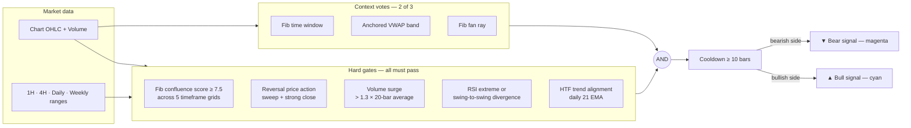

<div align="center">

# Force of Nature — IndicatorFON

**A multi-confluence Fibonacci signal engine for thinkorswim and TradingView**


</div>

Force of Nature is a chart study built around one idea: **a signal is only worth taking when many independent techniques agree at the same price, at the same time.** It scores Fibonacci confluence across five timeframes and demands a reversal bar, volume, momentum, and trend alignment before printing an arrow — by design, signals are rare.

Both platform versions are maintained in lockstep and run identical logic:

- **thinkorswim:** [`ForceOfNature.tos`](ForceOfNature.tos)
- **TradingView (Pine v6):** [`ForceOfNature.pine`](ForceOfNature.pine)
- **Design / port history:** [`docs/pine-conversion.md`](docs/pine-conversion.md)

> This is a redesigned descendant of the original script: several genuine bugs were fixed (a non-compiling `Sum()`, NaN score poisoning, inverted divergence logic, a pseudo-EMA trend filter) and the Fibonacci grids were re-anchored so signals no longer repaint or depend on how much chart history is loaded. The full change history is in the git log; design rationale is in the [docs](docs/pine-conversion.md).

---

## Signal pipeline



---

## Stage-by-stage breakdown

### Stage 1 — Swing detection (chart timeframe)

Fractal pivots (5 bars each side, 1.5×ATR minimum size) with **enforced alternation**: an opposite-side pivot starts a new leg; a same-side pivot only counts if it's more extreme than the current leg extreme. The tracked high/low pair is therefore always one real leg — the anchor for the chart grid, time windows, AVWAP, and fan. Pivots confirm 5 bars after the fact; that lag is inherent to fractal detection.

### Stage 2 — Multi-timeframe Fibonacci confluence (hard gate)

Each timeframe's grid is anchored to its **recent trading range** — the last N bars of that timeframe (defaults: 24×1H, 30×4H, 20 days, 13 weeks) — so the five grids are genuinely distinct, independent of loaded chart history, and non-repainting. Price near a level earns weighted points per grid:

```text
              ── 1.618 extension ───────────   +1.5
              ── 1.272 extension ───────────   +1.5
  range high ═══════════════════════════ 1.000
              ── 0.650 ─┐
                        ├─ GOLDEN POCKET ──    +3.5
              ── 0.618 ─┘
              ── 0.500 ──────────────────      +2.5
              ── 0.382 ─┐
                        ├─ BEAR POCKET ────    +3.5
              ── 0.350 ─┘
  range low  ═══════════════════════════ 0.000
              ── 1.272 extension (down) ──     +1.5
              ── 1.618 extension (down) ──     +1.5
```

The golden pocket and its bearish mirror score equally, so short setups are not structurally under-weighted. Each level's tolerance band has an ATR floor (0.15×) and widens with the grid's range (2%) — a weekly level gets a wider band than a 1-hour level. The summed score must reach **`confluenceThreshold` (7.5)**, which requires real agreement across multiple timeframes.

### Stage 3 — Context votes: time, AVWAP, fan (2 of 3 required)

Three location/timing conditions vote instead of all being mandatory — the old triple-AND of narrow bands made live signals practically impossible:

- **Fib time window:** the last leg's duration projected forward at 0.382/0.5/0.618/1.0/1.618; the bar must land within a window that scales with leg length (5% of span). Requires a real leg (span ≥ 8 bars).
- **Anchored VWAP:** volume-weighted average price anchored at the last swing; price within 0.25×ATR.
- **Fib fan:** rays from the last swing at 38.2/50/61.8% of the leg's slope; price within the chart grid's tolerance.

### Stage 4 — Reversal price action (hard gate)

| Side | Requirements |
|---|---|
| **Bull** | New low below prior bar **and** close above open **and** close above prior close **and** close in the **top 40%** of the bar's range |
| **Bear** | New high above prior bar **and** close below open **and** close below prior close **and** close in the **bottom 40%** of the bar's range |

A sweep-and-reclaim hammer for longs; a sweep-and-reject shooting star for shorts.

### Stage 5 — Volume surge (hard gate, toggleable)

Bar volume above **1.3× the 20-bar average**. Note that extended-hours bars distort the average — keep the extended-hours setting consistent when comparing platforms.

### Stage 6 — RSI extreme or divergence (hard gate, toggleable)

RSI(14) at an extreme (≤40 for longs, ≥60 for shorts), **or** a regular divergence measured swing-to-swing: price sets a lower low across the two most recent swing lows while RSI at those same pivots sets a higher low (mirrored for bearish).

### Stage 7 — Higher-timeframe trend (hard gate, toggleable)

A **true 21-period EMA of the configured higher timeframe** (daily by default), computed on that timeframe's own bars. Longs only above it, shorts only below.

### Stage 8 — Cooldown

After any signal, the study stands down for **10 bars** (input), so one setup produces one arrow instead of a cluster.

---

## Chart output

| Element | Appearance | Meaning |
|---|---|---|
| Bull signal | Cyan up-arrow below the bar | All gates + context votes + cooldown passed, bullish |
| Bear signal | Magenta down-arrow above the bar | Same, bearish |
| AVWAP | Yellow dashed line hugging price | VWAP anchored at the last swing |
| Dashboard | Label (ToS) / table (TV) | Live gate status |

Dashboard fields: `Score` (current confluence total), `Time / AVWAP / Fan` (✓/×  context votes), `RSI` (✓ signal · condition met × not met), `HTF` (▲/▼/─ trend). The TradingView table adds `Grids: n/5` — how many timeframe grids can exist on this chart. The TradingView version also exposes every gate and per-grid score in the **Data Window** (hover any bar to see exactly which condition failed), shows `Score`/`Bull now`/`Bear now` in the status line, and has `alertcondition` hooks for both signals.

---

## Inputs reference

| Input | Default | Description |
|---|---|---|
| `showSignals` | `yes` | Master toggle for the arrows |
| `confluenceThreshold` | `7.5` | Minimum summed Fib score |
| `toleranceATR` | `0.15` | Level-proximity band floor, in ATRs |
| `toleranceRangePct` | `0.02` | Level band as a fraction of each grid's range |
| `avwapBandATR` | `0.25` | AVWAP proximity band, in ATRs |
| `minContextGates` | `2` | Context votes required (of time / AVWAP / fan) |
| `cooldownBars` | `10` | Bars to stand down after a signal |
| `timeToleranceBars` | `2` | Minimum time-window tolerance |
| `minSwingATR` | `1.5` | Minimum chart swing size, in ATRs |
| `lookback1H / 4H / D / W` | `24 / 30 / 20 / 13` | Bars of each timeframe defining its grid range |
| `requireVolume` / `volumeMult` | `yes` / `1.3` | Volume gate |
| `requireHTFTrend` / `htfAgg` | `yes` / `DAY` | Trend gate and its timeframe |
| `requireRSI` / `rsiLength` / `rsiOversold` / `rsiOverbought` | `yes` / `14` / `40` / `60` | RSI gate |
| `showDashboard` / `showAVWAP` | `yes` | Display toggles (TV adds dashboard position) |

---

## Installation

**thinkorswim:** Charts → Studies (flask) → Edit studies… → **Create…** → paste [`ForceOfNature.tos`](ForceOfNature.tos) → name it → OK → Apply. **The chart must be 1 hour or lower** (e.g. `180 D : 1h`) — thinkorswim refuses secondary aggregations below the chart's timeframe, so the 1H grid request errors out on 2h/4h/daily charts (the ⓘ icon in the chart's corner shows the message).

**TradingView:** Pine Editor → paste [`ForceOfNature.pine`](ForceOfNature.pine) → Add to chart. Works on any timeframe — grids below the chart's timeframe are disabled instead of erroring, and the dashboard shows `Grids: n/5`. All five grids are active on charts of 1h or below, matching thinkorswim.

When comparing the two platforms, match the **extended-hours setting** on both — it changes the ATR, volume average, and swing pivots.

---

## Design notes & caveats

- **Signals are rare by design** — five hard gates, a 2-of-3 context vote, and a cooldown. Use the dashboard/Data Window to see how close conditions are; loosen `confluenceThreshold` or gate toggles to trade frequency for selectivity.
- **Non-repainting by construction:** grids use fixed per-timeframe lookbacks, all other gates are causal, and pivots confirm 5 bars after the fact. Levels still update within the *current* HTF bar (as any HTF-aware indicator does), but a printed arrow never disappears when later bars arrive.
- RSI and EMA warm-up means the first ~20 bars of a chart can't signal; the weekly grid needs 13 weeks of data to be meaningful.
- This is an **analysis tool, not financial advice**. Backtest and paper-trade before risking capital.
